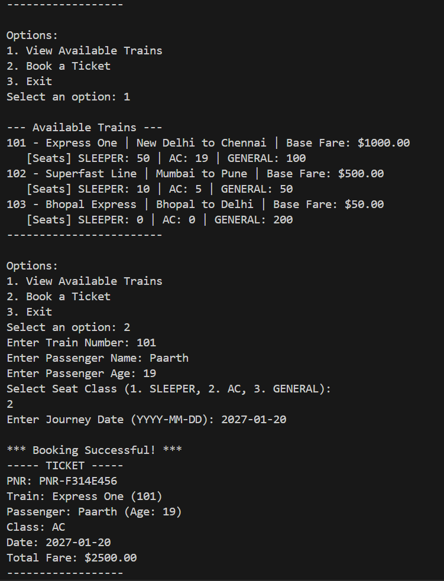

# Project Submission: Vityarthi - Programming in Java
# Paarth Juneja, 24BAI10160

# Advanced Railway Reservation System

This repository contains a comprehensive console application built in Java for managing railway ticket reservations. It simulates a complete booking system including train scheduling, seat availability tracking, dynamic fare calculation, and permanent file storage.

## Usage

## Core Features

The application provides a variety of detailed features to ensure a stable and persistent booking experience:

*   **Dynamic Class Pricing**: Fare is calculated automatically based on the base train fare and a multiplier tied to the selected travel class (AC, Sleeper, or General).
*   **Centralized Ticket Booking**: Users can generate passenger tickets with a unique PNR, journey date, and personal details.
*   **Capacity Validation**: The system strictly deducts available inventory from the exact seat tier chosen during booking.
*   **Persistent Storage Synchronization**: Train capacities and confirmed reservations are safely synchronized to local text files using Java NIO. This ensures data is perfectly retained between server sessions.
*   **Robust Input Handling**: The application natively handles improper user input by catching formatting errors and type mismatches without crashing the main application thread.

## System Architecture

The project codebase is strictly separated into logical packages to mirror real world software construction:

1.  **Models (com.railway.models)**: Contains isolated business entities including Train, Ticket, Passenger, and the SeatClass enumeration. All state variables are heavily encapsulated.
2.  **Service (com.railway.service)**: Contains the ReservationService class. This orchestrates high level logic such as checking capacity limits, calculating money totals, and finalizing bookings securely.
3.  **Repository (com.railway.repository)**: Contains TrainRepository and FileStorage. These classes handle the in memory collections and the IO operations required to store state.
4.  **Exceptions (com.railway.exceptions)**: Custom Java exceptions to cleanly pass specific business errors back to the user interface layer.

## Storage Configuration

The system uses standard comma separated text files to act as a backend database. 

### trains.txt
This file must be located in the root of the project directory. The program relies on this file to track all active trains in the network.
Format required: `TrainNumber,TrainName,Source,Destination,BaseFare,SleeperSeats,ACSeats,GeneralSeats`

### bookings.txt
This file is generated automatically when the first successful booking is executed. It safely stores all historical ticket transactions.
Format generated: `PNR,TrainNumber,PassengerName,PassengerAge,SeatClass,Date,TotalPaid`

## Prerequisites

*   JDK version 8 or higher
*   A functional terminal or command prompt interface

## Compilation Instructions

Follow these instructions to statically compile the project source code from scratch.

1.  Open your terminal interface.
2.  Navigate to the root folder of the project.
3.  Execute the following command to compile all associated Java files simultaneously. (This command will automatically create an `out` folder containing your bytecodes):
    `javac -d out -sourcepath src src/com/railway/Main.java`

## Execution Instructions

Once the application is compiled, you can launch the console interface.

1.  Keep your terminal situated in the root folder.
2.  Run the application using the Java classpath configuration:
    `java -cp out com.railway.Main`
3.  Follow the interactive menu prompts to view active trains and finalize ticket reservations.

## Error Prevention

The system includes multiple layers of defensive programming to intercept catastrophic failures:
*   Invalid date entries fall back gracefully using `DateTimeParseException` handlers.
*   Non numeric typed inputs are absorbed by `InputMismatchException` boundary logic.
*   Attempting to book a full train triggers a specific `TrainCapacityException`.
